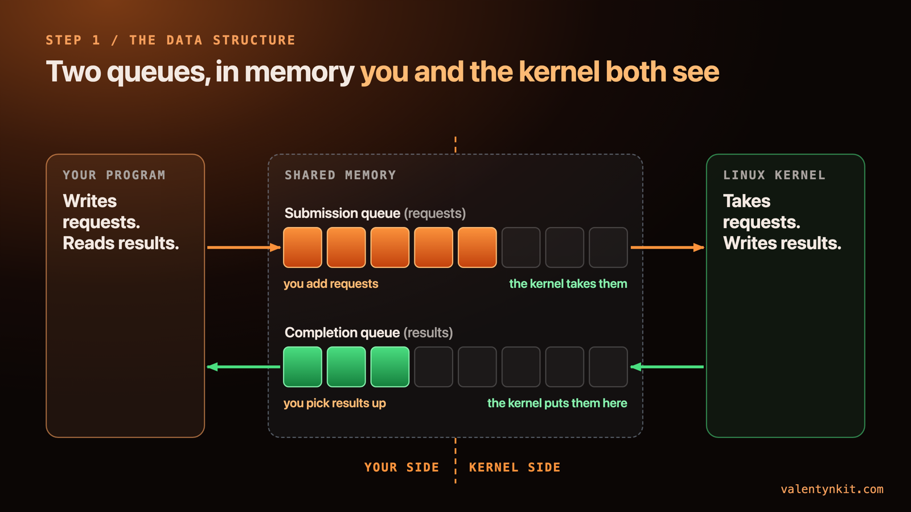
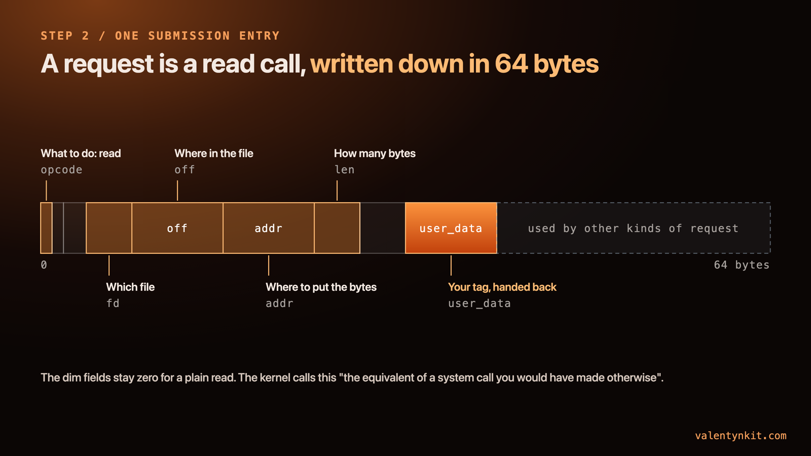
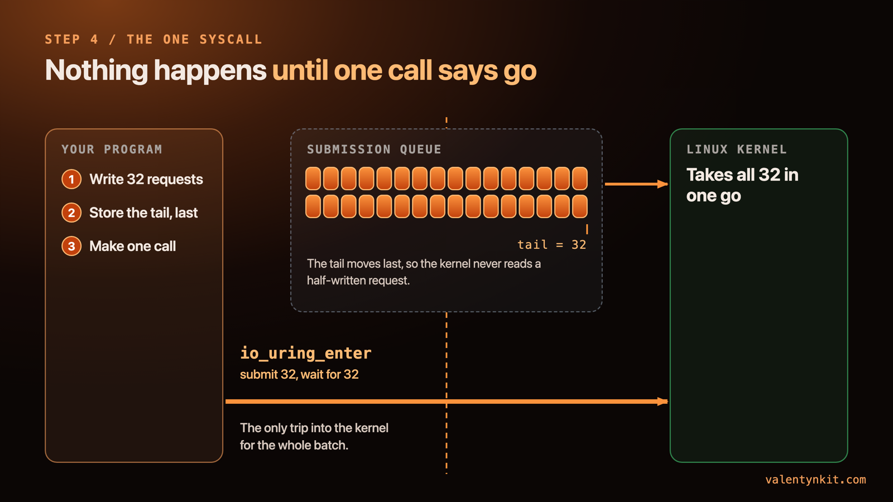
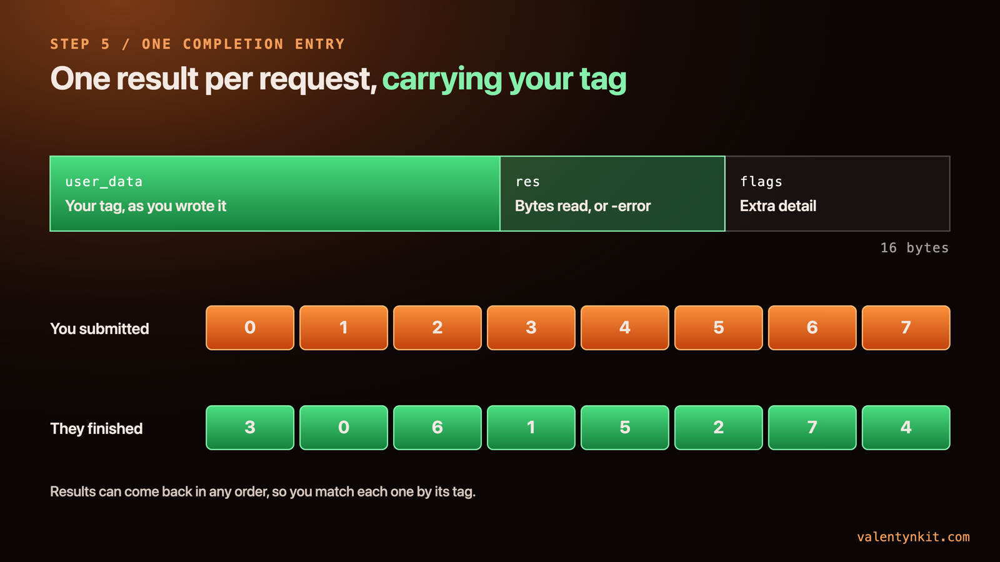
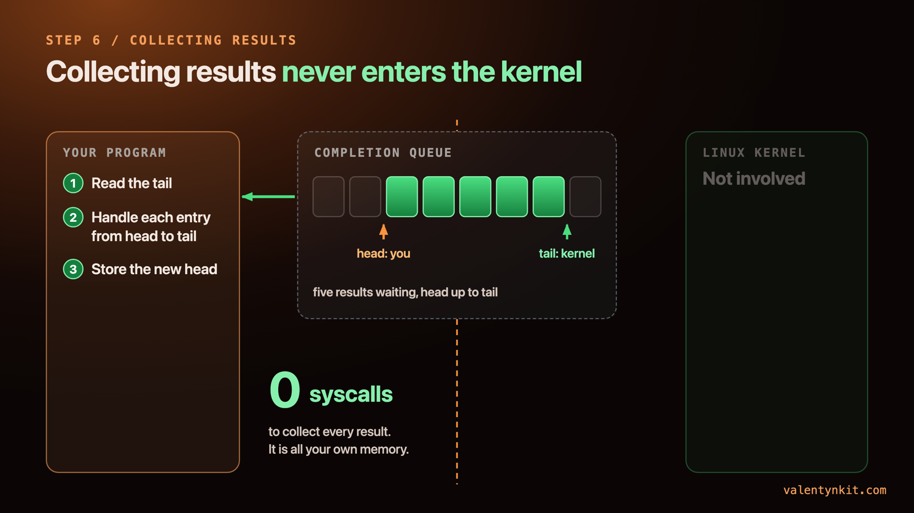
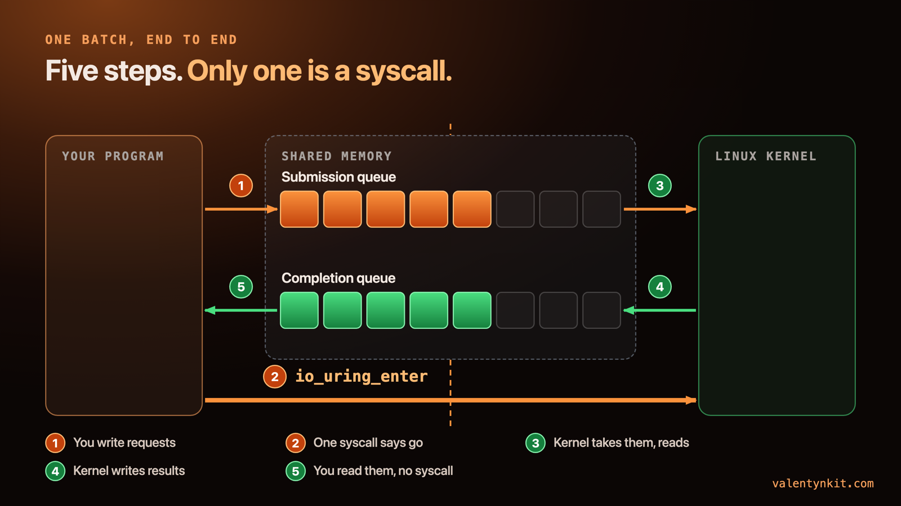
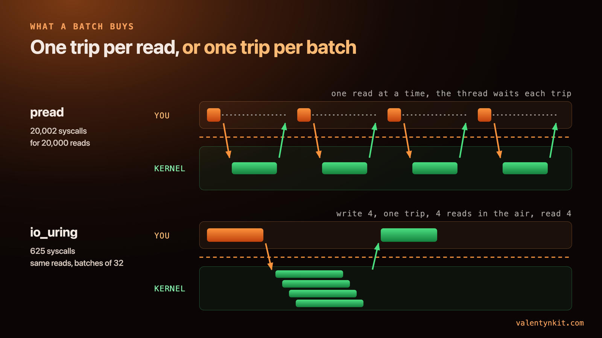
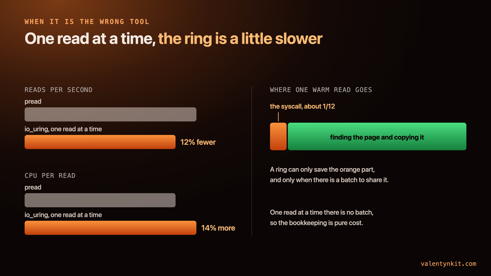

io_uring is two ring buffers that your program and the Linux kernel map into the same memory. You write requests into one, make a single system call that says go, and read the results out of the other without entering the kernel at all. It pays off when you have many independent requests ready at once. For a read that waits on its own result, a plain `pread` is as fast or faster.

For years all I knew about it was "fewer syscalls". That told me nothing about how it works, so I wrote one by hand in Rust, with no library in between, so I could see every byte. This post builds it up the way it finally made sense to me: one piece at a time, one picture per piece, with the real code from my reader beside each step.

## Why does io_uring exist?

Every read your program makes is a trip into the kernel. You call `read`, the CPU switches into kernel mode, the kernel finds your bytes, and it switches back. One request, one trip, and your thread waits for it.

For one request that is fine. For a database flushing a hundred pages, or a server juggling ten thousand sockets, it is a lot of trips. Those programs have a pile of work ready at the same moment, and they would rather hand the kernel the whole pile and get on with something else.

io_uring, in the kernel since 5.1, is how Linux lets them do that.

**The bench**, because the numbers later on depend on it: a Linux VM (Ubuntu 25.10, kernel 7.0, 10 cores) on an Apple M4 under OrbStack, reading a 4 GiB file with 4 KiB reads. The VM's disk is a file on the Mac, so nothing here measures a real device, only the software path. Every case ran nine times; the first was thrown away and I report the median of the other eight.

## What is the data structure?

When you set up io_uring with `io_uring_setup`, the kernel creates two ring buffers and hands back a file descriptor. Your program `mmap`s that descriptor, and from then on the same memory is visible to your program and to the kernel at once. The man page puts it plainly: the queues "are shared between userspace and the kernel, which eliminates the need to copy data when initiating and completing I/O".

One ring carries requests from you to the kernel. That is the **submission queue** (SQ). The other carries results from the kernel back to you. That is the **completion queue** (CQ).

That is the whole data structure. Everything else is about who writes where, and when.



## What is inside a request?

Each slot in the submission queue holds one request, a **submission queue entry** (SQE). It is 64 bytes, and for a read it carries everything the `read` call would have carried as arguments:

- **opcode**: what to do, here a read
- **fd**: which file
- **off**: where in the file
- **addr**: where to put the bytes, an address in your memory
- **len**: how many bytes
- **user_data**: eight bytes that are only for you

The kernel never looks inside `user_data`. It hands it back, untouched, when the request is done. The rest of the 64 bytes is a stack of unions used by the thirty-odd other kinds of request, and stays zero for a plain read.

`man 7 io_uring` describes an entry as "the equivalent of a system call you would have made otherwise". That is the easiest way to hold it in your head: you write the read down and leave it where the kernel will find it.



Adding one in my reader is a struct write and a counter bump, no syscall:

```rust
/// Fill one slot with a read. No syscall here: this is a memory write.
pub fn push_read(
    &mut self,
    fd: i32,
    buf: *mut u8,
    len: u32,
    off: u64,
    user_data: u64,
    force_async: bool,
) {
    let idx = self.tail_local & self.sq_mask;
    let sqe = Sqe {
        opcode: IORING_OP_READ,
        flags: if force_async { IOSQE_ASYNC } else { 0 },
        fd,
        off,
        addr: buf as u64,
        len,
        user_data,
        ..Sqe::default()
    };
    unsafe {
        ptr::write(self.sqes.add(idx as usize), sqe);
        ptr::write(self.sq_array.add(idx as usize), idx);
    }
    self.tail_local = self.tail_local.wrapping_add(1);
    self.pending += 1;
}
```

The second write fills an index array the kernel reads the entries through; in a reader this simple, slot `i` always points at entry `i`. `force_async` is there for an experiment and is `false` everywhere in this post.

## How do the head and tail work without locks?

Each ring is a fixed number of slots with two counters. The **tail** says where the next entry goes in. The **head** says where the next entry comes out.

The counters only ever go up. The slot is the counter masked by the ring's size (`tail & ring_mask`, straight from the man page), so after the last slot comes the first one again.

What makes io_uring work without locks is who owns each counter:

- On the submission queue, **you** move the tail as you add requests, and **the kernel** moves the head as it takes them.
- On the completion queue it flips: **the kernel** moves the tail as results arrive, and **you** move the head as you read them.

Every counter has exactly one writer. Your program and the kernel never write the same number, so neither side ever waits for the other to let go of anything.


## How does the kernel know there is work?

Writing entries into the ring tells the kernel nothing by itself. After you write your batch, you make one system call, `io_uring_enter`, with two numbers in it: how many new entries to submit, and how many results to wait for. The same call can do both.

There is one rule before that call. The new tail has to be stored after the entries are completely written, and stored in a way the CPU is not allowed to move earlier. Otherwise the kernel could see the tail move and read a half-written entry. In Rust that is a `Release` store:

```rust
/// Publish the batch and wait for `wait_for` of them. One syscall.
pub fn submit_and_wait(&mut self, wait_for: u32) -> io::Result<u32> {
    let to_submit = self.pending;
    unsafe { (*self.sq_tail).store(self.tail_local, Ordering::Release) };
    let rc = unsafe {
        syscall(
            SYS_IO_URING_ENTER,
            self.fd,
            to_submit,
            wait_for,
            IORING_ENTER_GETEVENTS,
            ptr::null::<c_void>(),
            0usize,
        )
    };
    if rc < 0 {
        return Err(io::Error::last_os_error());
    }
    self.pending -= rc as u32;
    Ok(rc as u32)
}
```

`tail_local` is my private copy of the tail. Every `push_read` bumps it, and the shared tail the kernel watches is written once per batch instead of once per read. Thirty-two reads, one call. That is a batch.



## How do results come back?

For every entry you submit, the kernel writes exactly one **completion queue entry** (CQE). It is 16 bytes: your `user_data`, handed back untouched, then `res`, which holds what the read would have returned, then `flags`. The man page is exact about `res`: it is the syscall's return value, so the number of bytes on success and a negative errno on failure. There is no `errno` variable in this world, because nothing returned to you.

The tag exists because results can come back in any order. Two reads submitted together can finish the other way round, so each result carries the tag of the request it belongs to. In my reader the tag is just the index of the buffer that read went into.



## Why does collecting results cost no syscall?

This is the part that is easy to miss if all you heard was "fewer syscalls". The completion queue is in your memory. To collect results you load the tail, walk from your head up to it, handle each entry, and store the new head so the kernel knows those slots are free again.

```rust
/// Drain the completion ring. No syscall: shared memory and one store.
pub fn reap(&mut self, out: &mut Vec<(u64, i32)>) -> u32 {
    let head = unsafe { (*self.cq_head).load(Ordering::Relaxed) };
    let tail = unsafe { (*self.cq_tail).load(Ordering::Acquire) };
    let mut n = 0;
    let mut h = head;
    while h != tail {
        let cqe = unsafe { *self.cqes.add((h & self.cq_mask) as usize) };
        out.push((cqe.user_data, cqe.res));
        h = h.wrapping_add(1);
        n += 1;
    }
    unsafe { (*self.cq_head).store(h, Ordering::Release) };
    n
}
```

The `Acquire` load pairs with the kernel's publish of the tail, so every entry before it is fully written when I read it. The `Relaxed` load of the head is safe because I am the only one who ever writes it. If the batch has already finished when you look, collecting all 32 results is a loop over your own memory.



## What does one batch look like end to end?

1. You write the requests and move the submission tail.
2. You make one call, `io_uring_enter`.
3. The kernel takes the requests off the submission head and does the reads.
4. It writes one result per request at the completion tail.
5. You read them off the completion head.

Five steps, and only one of them is a system call.



## What does batching buy?

The saving comes in two places. Your program stops paying one trip per request, and many requests can be in the air at once instead of one after another.

I counted the first one under `strace`. Twenty thousand reads with plain `pread` made 20,002 system calls (the extra two are the dynamic loader, before my code runs). The same twenty thousand reads through the ring, in batches of 32, made 625, which is 20,000 divided by 32 exactly.

The second one matters more. With `pread` your thread asks for one read and waits before it can ask for the next. With a ring, 32 reads arrive together and the storage underneath can work on all of them at the same time. That is where io_uring earns its reputation: background page flushes, big scans, servers with thousands of connections, anything with lots of independent requests and nobody waiting on a single one.



## When is io_uring the wrong tool?

If your code reads one block and waits for it before doing anything else, you have a batch of one. And a read is already one system call.

So the ring saves nothing and adds bookkeeping: write an entry, store the tail, the kernel reads your entry and writes a result, you read that back. On my bench, reading one 4 KiB block at a time from a file already in the page cache, the ring managed 12% fewer reads per second than `pread` and spent 14% more CPU on each read.

Even the trip it could save is small there. A bare syscall (`getppid` in a loop) cost me 86 nanoseconds. A warm 4 KiB `pread` cost 1.067 microseconds of CPU, so the syscall is about a twelfth of it. The rest is the kernel finding the page and copying it into your buffer, and a ring does not touch that part.

I nearly published the opposite. My first run had the ring twice as fast one read at a time, because I ran each case once and the first timed run of anything on that machine is slow. With a warm-up run thrown away and the median of eight more, the result flipped, and it stayed flipped across four full runs.



Oracle found the same thing on real NVMe hardware when they put io_uring under their database ([arXiv:2609.22781](https://arxiv.org/abs/2609.22781)). Their table of I/O patterns lists the single-block read, the most common I/O in OLTP, with the benefit "None" and the rationale "Already one syscall (pread)". They kept `pread` for reads that wait and moved the batched background writes onto the ring, where, with the write path isolated, CPU per write dropped 29%.

Side by side:

| | `pread` | io_uring |
|---|---|---|
| Syscalls for 20,000 reads | 20,002 | 625 (batches of 32) |
| Reads in flight per thread | one | as many as the batch |
| Getting a result | the call's return value | a load from shared memory |
| One read at a time, warm cache | baseline | 12% fewer reads/s, 14% more CPU per read |
| Best fit | read one block, then wait | many independent reads, nobody waiting on one |

## What should you do with this?

You will not write a ring by hand in production. [tokio-uring](https://github.com/tokio-rs/tokio-uring), the [io-uring](https://crates.io/crates/io-uring) crate and [glommio](https://github.com/DataDog/glommio) do the mapping and the memory ordering for you.

What no library decides is whether you have a batch, and that is the question I now ask of every read in my own code: how many other reads could be in flight beside it? When the answer is one, `pread` wins by a little. When it is dozens, the saving is the two things drawn above: one call for the whole pile, and results picked up from your own memory.

Which read in your service could have thirty others in the air beside it?

## Cheat sheet

- **Submission queue (SQ):** the ring of requests. You write, the kernel reads.
- **SQE:** one 64-byte request. Opcode, file, offset, buffer address, length, and your tag.
- **Completion queue (CQ):** the ring of results. The kernel writes, you read.
- **CQE:** one 16-byte result. Your tag, the return value (`res`), and flags.
- **Tail:** where the next entry goes in. Moved by whoever adds entries.
- **Head:** where the next entry comes out. Moved by whoever takes them.
- **user_data:** your tag. Handed back untouched, so out-of-order results still find their request.
- **io_uring_enter:** the one syscall. Submit N requests, optionally wait for M results.
- **Batch:** how many requests are in flight at once. The whole payoff depends on this number.

## Sources

- `man 2 io_uring_setup`, `man 2 io_uring_enter`, `man 7 io_uring`, and the uapi header `linux/io_uring.h`, read on the bench machine.
- Rajarshi Chowdhury, Akshay Shah, Margaret Susairaj, Ayush Agrawal, "io_uring in Oracle Database: A Hybrid Storage I/O Architecture at Production Scale", [arXiv:2609.22781](https://arxiv.org/abs/2609.22781), September 2026.
- My reader: two readers over one file, `pread` and a hand-built ring with no dependencies, timed as described in the bench paragraph above.
